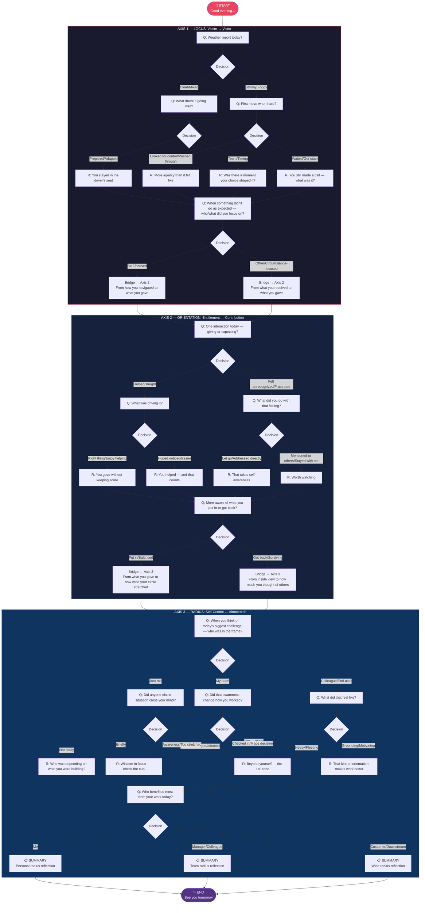

# Reflection Tree — Visual Diagram

```mermaid
flowchart TD
    START([🌙 START\nGood evening...]) --> A1_OPEN

    subgraph AXIS1["AXIS 1 — LOCUS: Victim ↔ Victor"]
        A1_OPEN[Q: Weather report today?] --> A1_D1{Decision}
        A1_D1 -->|Clear/Mixed| A1_Q_HIGH[Q: What drove it going well?]
        A1_D1 -->|Stormy/Foggy| A1_Q_LOW[Q: First move when hard?]

        A1_Q_HIGH --> A1_D2_HIGH{Decision}
        A1_D2_HIGH -->|Prepared/Adapted| A1_R_INT_STRONG[R: You stayed in the driver's seat]
        A1_D2_HIGH -->|Team/Timing| A1_R_EXT_MILD[R: Was there a moment your choice shaped it?]

        A1_Q_LOW --> A1_D2_LOW{Decision}
        A1_D2_LOW -->|Looked for control/Pushed through| A1_R_INT_MILD[R: More agency than it felt like]
        A1_D2_LOW -->|Waited/Got stuck| A1_R_EXT_STRONG[R: You still made a call — what was it?]

        A1_R_INT_STRONG --> A1_Q2
        A1_R_INT_MILD --> A1_Q2
        A1_R_EXT_MILD --> A1_Q2
        A1_R_EXT_STRONG --> A1_Q2

        A1_Q2[Q: When something didn't go as expected — who/what did you focus on?] --> A1_D3{Decision}
        A1_D3 -->|Self-focused| BRIDGE_1_2_INT[Bridge → Axis 2\nFrom how you navigated to what you gave]
        A1_D3 -->|Other/Circumstance-focused| BRIDGE_1_2_EXT[Bridge → Axis 2\nFrom what you received to what you gave]
    end

    subgraph AXIS2["AXIS 2 — ORIENTATION: Entitlement ↔ Contribution"]
        BRIDGE_1_2_INT --> A2_OPEN
        BRIDGE_1_2_EXT --> A2_OPEN

        A2_OPEN[Q: One interaction today — giving or expecting?] --> A2_D1{Decision}
        A2_D1 -->|Helped/Taught| A2_Q_CONTRIB[Q: What was driving it?]
        A2_D1 -->|Felt unrecognized/Frustrated| A2_Q_ENTITLE[Q: What did you do with that feeling?]

        A2_Q_CONTRIB --> A2_D2_CONTRIB{Decision}
        A2_D2_CONTRIB -->|Right thing/Enjoy helping| A2_R_CONTRIB_PURE[R: You gave without keeping score]
        A2_D2_CONTRIB -->|Hoped noticed/Easier| A2_R_CONTRIB_MIXED[R: You helped — and that counts]

        A2_Q_ENTITLE --> A2_D2_ENTITLE{Decision}
        A2_D2_ENTITLE -->|Let go/Addressed directly| A2_R_ENTITLE_MILD[R: That takes self-awareness]
        A2_D2_ENTITLE -->|Mentioned to others/Stayed with me| A2_R_ENTITLE_STRONG[R: Worth watching]

        A2_R_CONTRIB_PURE --> A2_Q2
        A2_R_CONTRIB_MIXED --> A2_Q2
        A2_R_ENTITLE_MILD --> A2_Q2
        A2_R_ENTITLE_STRONG --> A2_Q2

        A2_Q2[Q: More aware of what you put in or got back?] --> A2_D3{Decision}
        A2_D3 -->|Put in/Balanced| BRIDGE_2_3_CONTRIB[Bridge → Axis 3\nFrom what you gave to how wide your circle stretched]
        A2_D3 -->|Got back/Surviving| BRIDGE_2_3_ENTITLE[Bridge → Axis 3\nFrom inside view to how much you thought of others]
    end

    subgraph AXIS3["AXIS 3 — RADIUS: Self-Centric ↔ Altrocentric"]
        BRIDGE_2_3_CONTRIB --> A3_OPEN
        BRIDGE_2_3_ENTITLE --> A3_OPEN

        A3_OPEN[Q: When you think of today's biggest challenge — who was in the frame?] --> A3_D1{Decision}
        A3_D1 -->|Just me| A3_Q_SELF[Q: Did anyone else's situation cross your mind?]
        A3_D1 -->|My team| A3_Q_TEAM[Q: Did that awareness change how you worked?]
        A3_D1 -->|Colleague/End-user| A3_Q_WIDE[Q: What did that feel like?]

        A3_Q_SELF --> A3_D2_SELF{Decision}
        A3_D2_SELF -->|Not really| A3_R_SELF_STRONG[R: Who was depending on what you were building?]
        A3_D2_SELF -->|Briefly| A3_R_SELF_MILD[R: Wisdom in focus — check the cup]
        A3_D2_SELF -->|Yes — colleague/affected| A3_R_TEAM[R: Beyond yourself — the 'us' zone]
        A3_D2_SELF -->|Yes — wider| A3_R_WIDE[R: That kind of orientation makes work better]

        A3_Q_TEAM --> A3_D2_TEAM{Decision}
        A3_D2_TEAM -->|Checked in/Made decision| A3_R_TEAM
        A3_D2_TEAM -->|Awareness/Too stretched| A3_R_SELF_MILD

        A3_Q_WIDE --> A3_D2_WIDE{Decision}
        A3_D2_WIDE -->|Grounding/Motivating| A3_R_WIDE
        A3_D2_WIDE -->|Heavy/Fleeting| A3_R_TEAM

        A3_R_SELF_STRONG --> A3_Q2
        A3_R_SELF_MILD --> A3_Q2
        A3_R_TEAM --> A3_Q2
        A3_R_WIDE --> A3_Q2

        A3_Q2[Q: Who benefited most from your work today?] --> A3_D3{Decision}
        A3_D3 -->|Me| SUMMARY_SELF
        A3_D3 -->|Manager/Colleague| SUMMARY_TEAM
        A3_D3 -->|Customer/Downstream| SUMMARY_WIDE
    end

    SUMMARY_SELF[📋 SUMMARY\nPersonal radius reflection] --> END
    SUMMARY_TEAM[📋 SUMMARY\nTeam radius reflection] --> END
    SUMMARY_WIDE[📋 SUMMARY\nWide radius reflection] --> END

    END([✨ END\nSee you tomorrow])

    style AXIS1 fill:#1a1a2e,stroke:#e94560,color:#fff
    style AXIS2 fill:#16213e,stroke:#0f3460,color:#fff
    style AXIS3 fill:#0f3460,stroke:#533483,color:#fff
    style START fill:#e94560,color:#fff
    style END fill:#533483,color:#fff
```